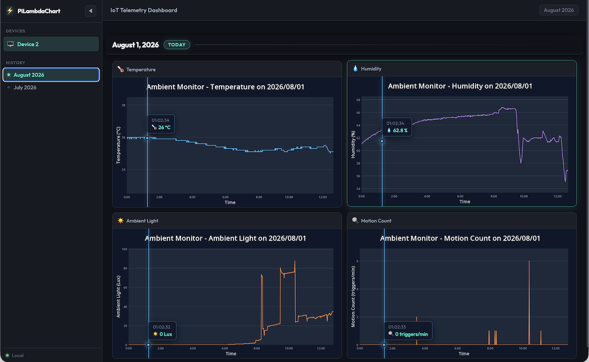
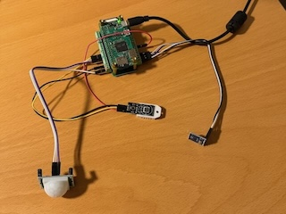
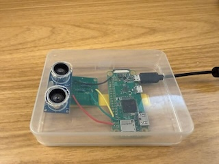

# PiLambdaChart

PiLambdaChart is an end-to-end serverless IoT telemetry platform that ingests environmental sensor data from Raspberry Pi edge devices into AWS DynamoDB, renders chart dashboards using a Java Lambda function, and serves interactive web dashboards globally via CloudFront and S3.

*PiLambdaChart Web Dashboard — Interactive multi-device, multi-metric telemetry charts with synchronized crosshairs and dark-slate aesthetics.* 

### Key Features
- **Static File Web Hosting (No Web Server Required)**: Served directly via Amazon S3 and Amazon CloudFront CDN without running or managing web servers.
- **100% Serverless AWS Infrastructure**: Utilizes Amazon DynamoDB for telemetry storage, EventBridge schedules, and Java AWS Lambda functions for automated chart generation.
- **Multi-Device & Multi-Sensor Support**: Scalable asynchronous architecture supporting multiple Raspberry Pi devices and arbitrary hardware sensors.
- **Modern Browser Dashboard with Synchronized Crosshairs**: Dark-slate aesthetic with dynamic metadata loading, sub-pixel accurate crosshair tooltips, sticky date headers, and lightbox modals.

---

## System Architecture

PiLambdaChart connects asynchronous edge sensors on Raspberry Pi devices with a serverless AWS backend and a static single-page web application.

### Component Overview
1. **Edge Client (`agent.py`)**: Asynchronous Python daemon running on Raspberry Pi edge devices that samples attached hardware sensors, buffers failed uploads in an in-memory retry queue, and uploads telemetry readings to DynamoDB.
2. **Amazon DynamoDB**: Fully managed serverless NoSQL database storing time-series telemetry data (`IoT_Telemetry`) and device/metric metadata registries (`IoT_Metadata`).
3. **Amazon EventBridge**: Automated schedule rule (e.g. `rate(5 minutes)`) that triggers the Lambda function periodically to generate updated charts.
4. **AWS Lambda (`ChartGeneratorHandler`)**: Serverless Java handler that queries telemetry from DynamoDB, calculates dynamic Y-axis bounds, renders JFreeChart PNGs and JSON sidecars, and uploads assets to S3.
5. **Amazon S3**: Static website storage hosting dashboard files (`index.html`, `style.css`, `app.js`), chart PNGs, JSON data sidecars, `file-list.json` indexes, and `metadata.json` exports.
6. **Amazon CloudFront**: Global Content Delivery Network (CDN) providing low-latency edge caching, Origin Access Control (OAC) to keep S3 private, HTTPS encryption, and optional HTTP Basic Authentication.
7. **Web Browser (`app.js`)**: Static single-page client application that fetches catalog indexes and sidecars, initializes `METRIC_META` dynamically, renders chart tile grids, and powers interactive synchronized crosshairs.

---

## Folder Structure

The repository is modularized into four component tiers. Click each module's link for detailed setup and usage documentation:

*   [`backend/`](backend/README.md) — **Java Compute Tier & CLI**: Java Maven project (`ChartGeneratorHandler` & `ChartGeneratorCLI`) querying DynamoDB telemetry and rendering JFreeChart PNGs and JSON sidecars.
*   [`edge/`](edge/README.md) — **Raspberry Pi Edge Client**: Asynchronous Python agent (`agent.py`) running on Raspberry Pi edge devices to gather sensor data (temperature, humidity, light, motion, water level), manage retry buffers, and upload readings to DynamoDB.
*   [`frontend/`](frontend/README.md) — **Web Telemetry Dashboard**: HSL dark-slate static web dashboard (`app.js`, `style.css`, `index.html`) featuring dynamic metadata loading, sticky date dividers, synchronized crosshairs, and lightbox modals.
*   [`infrastructure/`](infrastructure/README.md) — **Terraform Infrastructure as Code**: Declarative AWS IaC provisioning DynamoDB tables, S3 chart bucket, Java Lambda function, EventBridge schedules, CloudFront CDN, and IAM least-privilege security policies.

---

## Real-World Example & Hardware Setup

In a production environment, PiLambdaChart runs **Raspberry Pi** devices connected to hardware sensors:

- **Temperature & Humidity**: DHT22 / DHT11 GPIO sensor
- **Ambient Light**: BH1750 I2C lux sensor
- **Motion Events**: PIR motion sensor (GPIO interrupt counting)
- **Water / Fluid Level**: HC-SR04 ultrasonic distance sensor

*Raspberry Pi edge device connected to 3 sensors - DHT22, BH1750, and PIR motion sensor.* 

*HC-SR04 ultrasonic distance sensor for samp water level.* 

